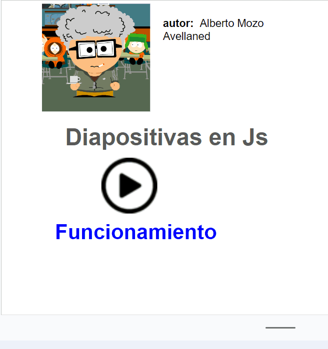

# Enunciado prueba
Crear con el editor de texto, una página web que contenga una imagen que vaya cambiando automáticamente cada cierto tiempo, siguiendo las instrucciones que se indican más abajo. La página con él script se deberá ver correctamente en el navegador Chrome.
Se dispondrá de 1,5 horas para la realización de la prueba. Se dará un aviso 15 minutos antes de la finalización del tiempo.

## Instrucciones
    1. Crear un documento HTML que contenga la estructura básica (Etiquetas: Tipo de documento, html, head, charset y body). Nombrarlo como “script-imagen.html”.
    2. En el nuevo documento se debe:
        a. Colocar la imagen “foto1.jpg”.
        b. Hacer que la imagen sea sustituida automáticamente por una nueva imagen. (Para ello se debe extraer, incluir y adaptar el código necesario del documento “base.html”).
(Tanto las imágenes como el documento “base.html” se encuentra en la carpeta “material” proporcionada por el docente)
    3. El script debe mostrar sucesivamente en el navegador las cuatro imágenes que se encuentran en la carpeta “material”
    4. Una vez conseguido que el script vaya mostrando las imágenes, aumentar el lapso de tiempo entre imágenes hasta 7 segundos.
    5. Añadir un botón que pare la sucesión de imágenes.
    6. Añadir un segundo botón que vuelva a iniciar la sucesión de imágenes.
    7. Salvar el documento y las imágenes en una carpeta con el nombre “UF1305_E2_nombre_apellido”.
   